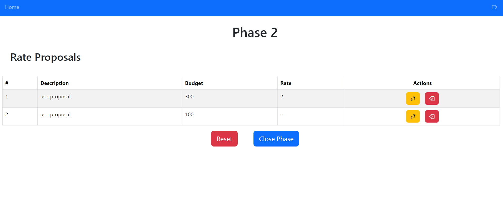
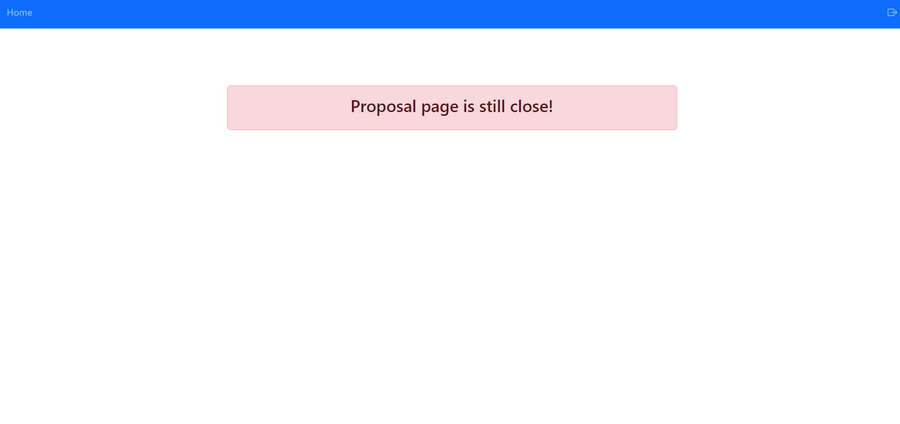

# Exam Title: "SOCIAL BUDGET".

## React Client Application Routes.

- Route `/login`: page contains the login form and proper validation for each field
- Route `/phase0`: page contains the budget of proposal, if the logged in user is admin, otherwise it displays a message
- Route `/phase1`: page contains all the proposals made by a user. Here users can add new proposals, edit existing ones or delete their own proposals
- Route `/create_proposal`: page contains a form to create a new proposal for the logged in user
- Route `/edit_proposal/:id`: page contains a form filled with previous proposal properties and the logged in user can modify them
- Route `/phase2`: page contains a list of proposals made by other users (except the proposals from the logged in user). Here each user can vote other users proposals 
- Route `/phase3`: page contains a list of proposals sorted by total rate. Only the approved ones have the name of the creator defined
- Route `/404`: page not found

## Main React Components.
- `Login` (in `Login.jsx`): component contains the login form
- `Phase0` (in `Phase0.jsx`): component shows a textbox to define a budget, and can direct to the other phase
- `Phase1` (in `Phase1.jsx`): component shows all proposals of the logged in user. Both admin and user can create new proposals, modify existing ones and delete their own proposals. Admin also can direct to the following phase.
- `Phase2` (in `Phase2.jsx`): component shows all proposals of other users except their own. User/admin can vote other proposals. Admin directs to the following phase
- `Phase3` (in `Phase3.jsx`): component shows all the proposals sorted by the total rank, with creator specified for approved proposals. Final phase, admin restarts the whole process.

## API Server.

- POST ` /login`: 
  - request parameters:
    - body: {
      "username": "string",
      "password": "string"
      } 
    - cookies: `connect.sid = "string"` 
  - response body: {
    "id": Number,
    "username": "string",
    "role": "string"
  }
- GET ` /auth`: 
  - request parameters:
    - body: {} 
    - cookies: `connect.sid = "string"` 
  - response body: {
    "message" : "Authenticated"
  }
- GET `/phase`: 
  - request parameters:
    - body: {} 
    - cookies: `connect.sid = "string"` 
  - response body: {
    "phase": "string"
  }
- GET `/phase/budget`: 
  - request parameters:
    - body: {} 
    - cookies: `connect.sid = "string"` 
  - response body: {
    "budget": Number
  }
- GET `/phase/change`: 
  - request parameters:
    - body: {} 
    - cookies: `connect.sid = "string"` 
  - response body: {
        "phase": "string"
  }
- PUT `/phase/budget/:budget`: 
  - request parameters:
    - parameters: `budget=Number`
    - body: {} 
    - cookies: `connect.sid = "string"` 
  - response body: {
    "phase": "string"
  }
- PUT `/phase/reset`: 
  - request parameters:
    - body: {} 
    - cookies: `connect.sid = "string"` 
  - response body: {
    "value": Boolean
  }
- GET `/user`: 
  - request parameters:
    - body: {} 
    - cookies: `connect.sid = "string"` 
  - response body: {
    "id": Number,
    "username": "string",
    "role": "string"
  }
- GET `/user/:id`: 
  - request parameters:
    - parameters: `id=Number`
    - body: {} 
    - cookies: `connect.sid = "string"` 
  - response body: {
    "id": Number,
    "username": "string",
    "role": "string"
  }
- GET `/user/name/:name`: 
  - request parameters:
    - parameters: `name=string`
    - body: {} 
    - cookies: `connect.sid = "string"` 
  - response body: {
    "id": Number,
    "username": "string",
    "password": "string",
    "salt": "string",
    "role": "string"
  }
- GET `/proposal`: 
  - request parameters:
    - body: {} 
    - cookies: `connect.sid = "string"` 
  - response body: {
    "id": Number,
    "username": "string",
    "description": "string",
    "budget": "string"
  }
- GET `/proposal/id/:id`: 
  - request parameters:
    - parameters: `id=Number`
    - body: {} 
    - cookies: `connect.sid = "string"` 
  - response body: {
    "id": Number,
    "username": "string",
    "description": "string",
    "budget": "string"
  }
- GET `/proposal/id/:id`: 
  - request parameters:
    - parameters: `id=Number`
    - body: {} 
    - cookies: `connect.sid = "string"` 
  - response body: {
    "id": Number,
    "username": "string",
    "description": "string",
    "budget": "string"
  }  
- GET `/proposal/:name`: 
  - request parameters:
    - parameters: `name=string`
    - body: {} 
    - cookies: `connect.sid = "string"` 
  - response body: {
    "id": Number,
    "username": "string",
    "description": "string",
    "budget": "string"
  }  
- POST `/proposal`: 
  - request parameters:
    - body: {
       "description": "string",
       "budget": "string"
    } 
    - cookies: `connect.sid = "string"` 
  - response body: {
    "id": Number,
    "username": "string",
    "description": "string",
    "budget": "string"
  }
- PUT `/proposal/:id`: 
  - request parameters:
    - parameters: `id=Number`
    - body: {
       "description": "string",
       "budget": "string"
    } 
    - cookies: `connect.sid = "string"` 
  - response body: {
    "id": Number,
    "username": "string",
    "description": "string",
    "budget": "string"
  }   
- PUT `/proposal/:id/approve`: 
  - request parameters:
    - parameters: `id=Number`
    - body: {} 
    - cookies: `connect.sid = "string"` 
  - response body: {
    "id": Number,
    "username": "string",
    "description": "string",
    "budget": "string"
  } 
- GET `/proposal/approved`: 
  - request parameters:
    - body: {} 
    - cookies: `connect.sid = "string"` 
  - response body: {
    "id": Number,
    "username": "string",
    "description": "string",
    "budget": "string"
  } 
- DELETE `/proposal/:id`: 
  - request parameters:
    - parameters: `id=Number`
    - body: {} 
    - cookies: `connect.sid = "string"` 
  - response body: {
    "id": Number,
    "username": "string",
    "description": "string",
    "budget": "string"
  } 
- GET `/vote/:proposalId`: 
  - request parameters:
    - parameters: `proposalId=Number`
    - body: {} 
    - cookies: `connect.sid = "string"` 
  - response body: Boolean
- POST `/vote/:proposalId`: 
  - request parameters:
    - parameters: `proposalId=Number`
    - body: {
      "rate": Number
    } 
    - cookies: `connect.sid = "string"` 
  - response body: Boolean
- PUT `/vote/:proposalId`: 
  - request parameters:
    - parameters: `proposalId=Number`
    - body: {
      "rate": Number
    } 
    - cookies: `connect.sid = "string"` 
    - response body: Boolean
- GET `/vote/:proposalId/total`: 
  - request parameters:
    - parameters: `proposalId=Number`
    - body: {} 
    - cookies: `connect.sid = "string"` 
    - response body: {
      "total": Number
    }
- PUT `/vote/:proposalId/revoke`: 
  - request parameters:
    - parameters: `proposalId=Number`
    - body: {} 
    - cookies: `connect.sid = "string"` 
    - response body: Boolean

## Database Tables

- Table `User` - contains (id, username, password, salt, role)
- Table `Proposal` - contains (id, budget, description, username) username foreign key with reference User(username)
- Table `Phase` - contains (id, username, budget)
- Table `Vote` - contains (id, rate, user_id, proposal_id) user_id foreign key with reference User(user_id) and proposal_id foreign key with reference Proposal(proposal_id)

## Screenshots

## Users Credentials.

- admin, admin1234
- user1, user1234
- user2, user1234
- user3, user1234
- user4, user1234
